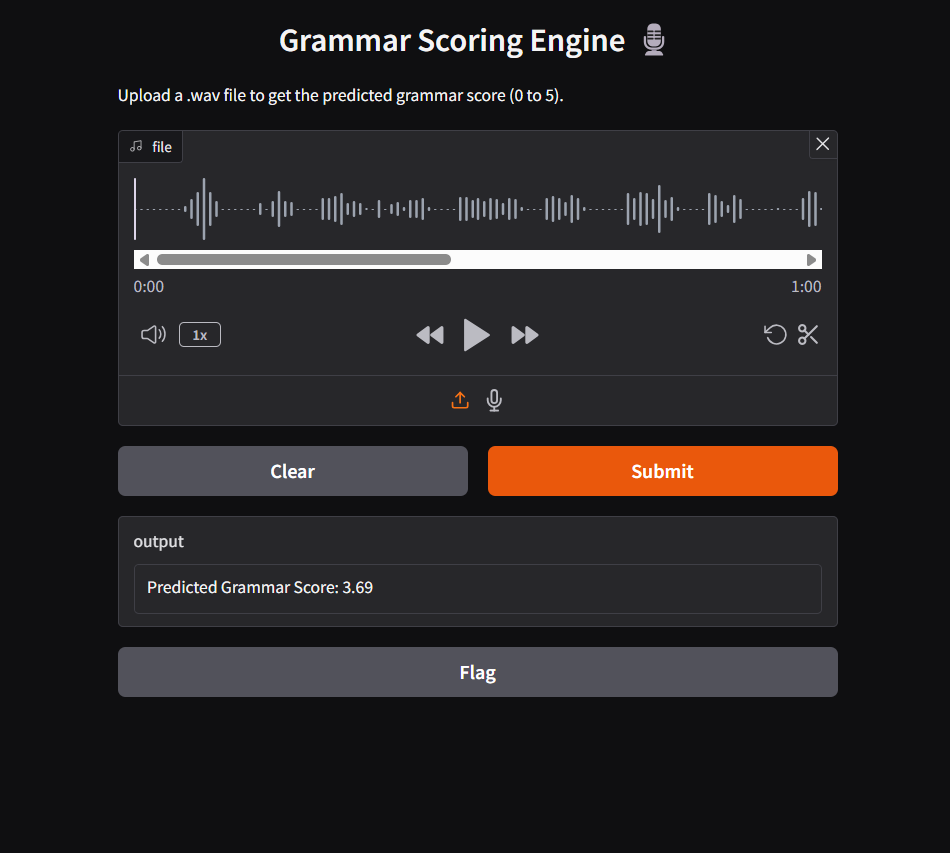
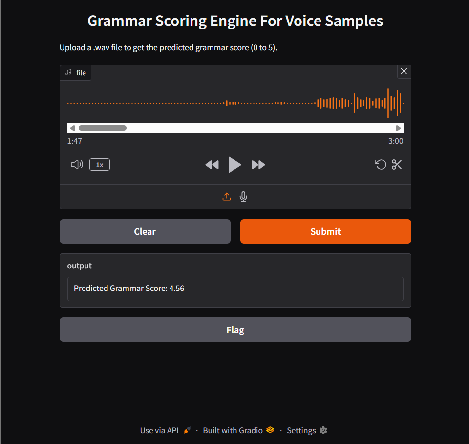
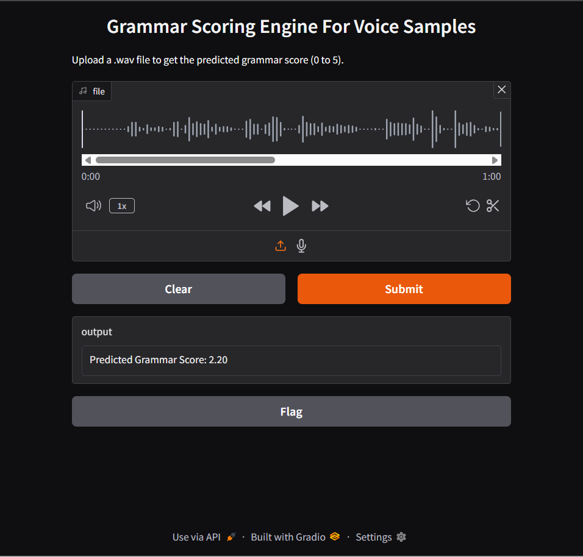

- We have dataset train.csv, test.csv, audio_test files, and audio_train files.
- Used Google Speech-to-Text API to transcribe the audio files into text form.
- Paired each of these transcriptions with their ground truth labels.
- Extracted various ranges of audio features like **MFCCs, Chrome, Spectral features, Tonnetz**
- Trained a RandomForestRegeressor, an ensemble method suitable for handling complex feature interactions.
- Gave a simple inference for the user or evaluator to upload an audio.wav file and receive a prediction score in between 0 to 5.

